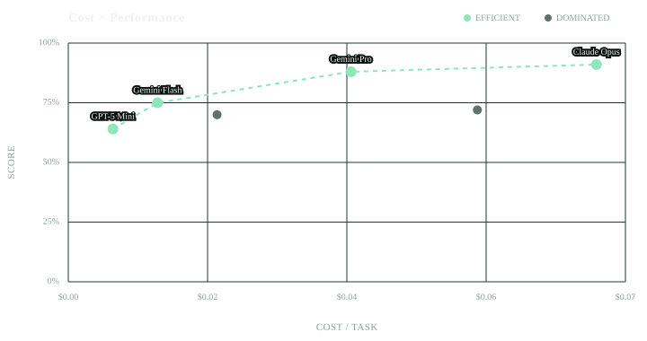

# Dari Pareto

`@mupt-ai/dari-pareto` is a standalone plotting package from
[Dari](https://dari.dev). It plots options that trade off two objectives—for
example, lower cost and higher benchmark score. A point is Pareto-efficient
when no other point is at least as good on both axes and strictly better on
one. Points that fail that test are dominated; the plot keeps them visible for
comparison.

Use the same data and styling for an interactive React chart or a static SVG
created in Node.js. Both axes can independently minimize or maximize, so the
package is not limited to cost and score.



> The package is not published yet. Its first release will be installed with
> `npm install @mupt-ai/dari-pareto react react-dom`. For now, clone this
> repository, run `bun install && bun run build`, and install its directory in
> another project with `npm install /path/to/dari-pareto`.

## Interactive React Plot

```tsx
import { ParetoPlot } from "@mupt-ai/dari-pareto";

const points = [
  { id: "small", label: "Small", x: 0.012, y: 72 },
  { id: "balanced", label: "Balanced", x: 0.025, y: 86 },
  { id: "large", label: "Large", x: 0.061, y: 91 },
];

export function ResultsPlot() {
  return (
    <ParetoPlot
      points={points}
      xAxis={{
        label: "Cost / Task",
        objective: "minimize",
        format: (value) => `$${value.toFixed(3)}`,
      }}
      yAxis={{
        label: "Score",
        objective: "maximize",
        domain: [0, 100],
        format: (value) => `${value.toFixed(0)}%`,
      }}
      onSelect={(point) => console.log(point.id)}
    />
  );
}
```

The SVG preserves its aspect ratio while scaling to its container width. Its
logical size defaults to `720 × 380`; use `width` and `height` to change it.
Each interactive point is a tab stop with a descriptive screen-reader label,
accepts pointer input, and is selectable with Enter or Space. `onSelect`
receives the complete selected point.

## Static SVG

```ts
import { writeFile } from "node:fs/promises";
import { renderParetoPlot } from "@mupt-ai/dari-pareto/static";

const points = [
  { id: "small", label: "Small", x: 0.012, y: 72 },
  { id: "balanced", label: "Balanced", x: 0.025, y: 86 },
];

const svg = renderParetoPlot({
  points,
  xAxis: { label: "Cost / Task", objective: "minimize" },
  yAxis: { label: "Score", objective: "maximize", domain: [0, 100] },
  showPointLabels: "frontier",
});

await writeFile("pareto.svg", svg);
```

`showPointLabels` accepts `"none"`, `"frontier"`, or `"all"` in both modes.
Use `<ParetoPlot mode="static" />` with the same props when React should render
a non-interactive SVG; its `onSelect` callback is ignored. Use
`renderParetoPlot` when a Node.js script needs an SVG string. The string
renderer uses `react-dom/server`; both paths share the same frontier, scales,
and drawing code.

## Frontier Utilities

```ts
import { dominates, paretoFrontier } from "@mupt-ai/dari-pareto";

const efficient = paretoFrontier(points, {
  xObjective: "minimize",
  yObjective: "maximize",
});

const leftDominatesRight = dominates(points[0], points[1], {
  xObjective: "minimize",
  yObjective: "maximize",
});
```

`minimize` treats smaller values as better; `maximize` treats larger values as
better. `dominates(candidate, other, options)` applies that test to two points.
When multiple points share exact coordinates, `paretoFrontier` returns all of
them because none strictly dominates another. Duplicate IDs or non-finite
coordinates throw an error; empty and single-point inputs are valid.

Axis `domain` sets an explicit `[minimum, maximum]` range. Without it, the plot
uses the supplied points and adds padding. Set `includeZero: true` to include
zero in an inferred domain.

## Styling

Override CSS variables on the plot or a parent element:

```css
.results-plot {
  --pareto-background: #09100f;
  --pareto-foreground: #eef4ed;
  --pareto-muted: #91a39b;
  --pareto-grid: #263631;
  --pareto-frontier: #8ee6bd;
  --pareto-point: #60736b;
}
```

## Development

Development requires Node.js 18 or later and Bun. Package consumers need React
18 or 19; the static string renderer also needs the matching `react-dom`
version.

```bash
bun install --frozen-lockfile
bun run typecheck
bun test
bun run test:package
```

## License

Apache-2.0
