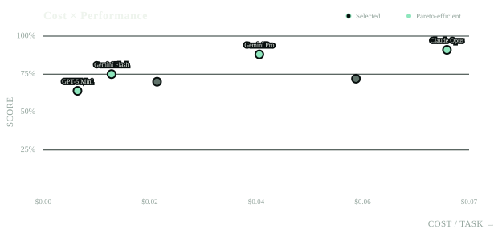

# Dari Pareto

`@mupt-ai/dari-pareto` is a standalone plotting package from
[Dari](https://dari.dev). It plots options that trade off two objectives—for
example, lower cost and higher benchmark score. A point is Pareto-efficient
when no other point is at least as good on both axes and strictly better on
one. Points that fail that test are dominated; the plot keeps them visible for
comparison.

Use the same data and styling for an interactive React chart or a static SVG
created in Node.js. Both axes can independently minimize or maximize, so the
package is not limited to cost and score.



> The package is not published yet. Its first release will be installed with
> `npm install @mupt-ai/dari-pareto react react-dom`. For now, clone this
> repository, run `bun install && bun run build`, and install its directory in
> another project with `npm install /path/to/dari-pareto`.

## Interactive React Plot

```tsx
import { ParetoPlot } from "@mupt-ai/dari-pareto";

const points = [
  { id: "small", label: "Small", x: 0.012, y: 72 },
  { id: "balanced", label: "Balanced", x: 0.025, y: 86 },
  { id: "large", label: "Large", x: 0.061, y: 91 },
];

export function ResultsPlot() {
  return (
    <ParetoPlot
      points={points}
      xAxis={{
        label: "Cost / Task",
        objective: "minimize",
        format: (value) => `$${value.toFixed(3)}`,
      }}
      yAxis={{
        label: "Score",
        objective: "maximize",
        domain: [0, 100],
        format: (value) => `${value.toFixed(0)}%`,
      }}
      onSelect={(point) => console.log(point.id)}
    />
  );
}
```

The SVG preserves its aspect ratio while scaling to its container width. Its
logical size defaults to `720 × 380`; use `width` and `height` to change it.
Each interactive point is a tab stop with a descriptive screen-reader label,
accepts pointer input, and is selectable with Enter or Space. `onSelect`
receives the complete selected point.

## Static SVG

```ts
import { writeFile } from "node:fs/promises";
import { renderParetoPlot } from "@mupt-ai/dari-pareto/static";

const points = [
  { id: "small", label: "Small", x: 0.012, y: 72 },
  { id: "balanced", label: "Balanced", x: 0.025, y: 86 },
];

const svg = renderParetoPlot({
  points,
  xAxis: { label: "Cost / Task", objective: "minimize" },
  yAxis: { label: "Score", objective: "maximize", domain: [0, 100] },
  showPointLabels: "frontier",
});

await writeFile("pareto.svg", svg);
```

`showPointLabels` accepts `"none"`, `"frontier"`, or `"all"` in both modes.
Use `<ParetoPlot mode="static" />` with the same props when React should render
a non-interactive SVG; its `onSelect` callback is ignored. Use
`renderParetoPlot` when a Node.js script needs an SVG string. The string
renderer uses `react-dom/server`; both paths share the same frontier, scales,
and drawing code.

## Frontier Utilities

```ts
import { dominates, paretoFrontier } from "@mupt-ai/dari-pareto";

const efficient = paretoFrontier(points, {
  xObjective: "minimize",
  yObjective: "maximize",
});

const leftDominatesRight = dominates(points[0], points[1], {
  xObjective: "minimize",
  yObjective: "maximize",
});
```

`minimize` treats smaller values as better; `maximize` treats larger values as
better. `dominates(candidate, other, options)` applies that test to two points.
When multiple points share exact coordinates, `paretoFrontier` returns all of
them because none strictly dominates another. Duplicate IDs or non-finite
coordinates throw an error; empty and single-point inputs are valid.

Axis `domain` sets an explicit `[minimum, maximum]` range. Without it, the plot
uses the supplied points and adds padding. Set `includeZero: true` to include
zero in an inferred domain.

## Optional Layout and Interaction

Each of these is off by default, so a plot that sets none of them looks exactly
as before.

- **Round ticks.** `nice: true` on an axis places ticks on round steps (1, 2,
  2.5 or 5 times a power of ten), with `ticks` as the approximate count, and
  rounds an inferred domain out to whole steps. With `includeZero`, an inferred
  domain of all-positive data then starts exactly at zero. An explicit `domain`
  is kept as given, with round ticks inside it.
- **Log scale.** `scale: "log"` on an axis suits values spanning orders of
  magnitude, such as prices: equal distances are equal ratios. Ticks fall on
  round values within each decade (1, 10, 100; or 1, 2, 5, 10, …), or on a round
  linear step when the data spans only part of a decade, and `nice` rounds the
  domain out to match. Values at or below zero, which a log scale cannot place,
  sit on a zero tick at the axis start in a short band of their own; the tooltip
  still shows their real value. `includeZero` does not apply.
- **Hover radius.** `hoverRadius: 36` makes the pointer inspect the nearest point
  within that many pixels instead of only the one directly under it. On touch
  screens a tap does the same, a tap away from every point puts the card away,
  and a touch that turns into a scroll opens nothing. Clicks select the nearest
  point in reach.
- **Groups.** Give each point a `group` (such as the vendor that made a model)
  and set `showGroups: true` for a row of chips above the plot, one per group,
  colored like the group's first point. Hovering or focusing a chip fades every
  point and label outside its group; a click or tap holds the highlight until
  the chip is pressed again. Static plots show the chips as a key.
- **Settings.** `showSettings: true` adds a quiet button in the top right corner
  of an interactive plot. It opens a small panel where the viewer sets the text
  size from 50 to 200 percent: typed (kept in range, to a whole percent, applied
  on Enter or on leaving the field), or with smaller and larger buttons that move
  to the next multiple of 10. Larger text also grows the space around the axes.
- **Label placement.** `labelPlacement: "auto"` places each label from
  `showPointLabels` above, beside, below or diagonally off its point, wherever it
  covers no point and no other label, preferring spots off the frontier line.
  Frontier labels are placed first. A label with no room is left out and still
  appears on hover. The default, `"above"`, centers every label above its point.
- **Tooltip.** `showTooltip: true` shows a card with the hovered or focused
  point's label, both axis values and its `description`, in place of its label,
  and dims the other labels. It sits beside the point, or above or below it on a
  plot too narrow for that. Interactive mode only.
- **Title and text size.** `showTitle: false` hides the title; with
  `showLegend: false` as well, the plot drops the space kept above it for them.
  `textScale` multiplies every text size and fits the left margin to the y-axis
  tick labels, so larger text or wider labels keep a gap from the y-axis title.

## Styling

Override CSS variables on the plot or a parent element:

```css
.results-plot {
  --pareto-background: #09100f;
  --pareto-foreground: #eef4ed;
  --pareto-muted: #91a39b;
  --pareto-grid: #263631;
  --pareto-frontier: #8ee6bd;
  --pareto-point: #60736b;
  /* Optional. Each falls back to the value shown in parentheses. */
  --pareto-frontier-line: #8ee6bd; /* (--pareto-frontier) */
  --pareto-glow: rgba(142, 230, 189, 0.7); /* (this mint, or a colored point's own color) */
  --pareto-tooltip-background: #09100f; /* (--pareto-background) */
}
```

To color points individually, for example by provider, give each point a
`color`, any CSS color. Pareto-efficient points are filled with it and
dominated points become rings in it, drawn slightly smaller so the filled points
stay the heavier mark. Hover and selection keep the point's color, and the
legend explains fill and ring instead of color.

## Development

Development requires Node.js 18 or later and Bun. Package consumers need React
18 or 19; the static string renderer also needs the matching `react-dom`
version.

```bash
bun install --frozen-lockfile
bun run typecheck
bun test
bun run test:package
```

## License

Apache-2.0
